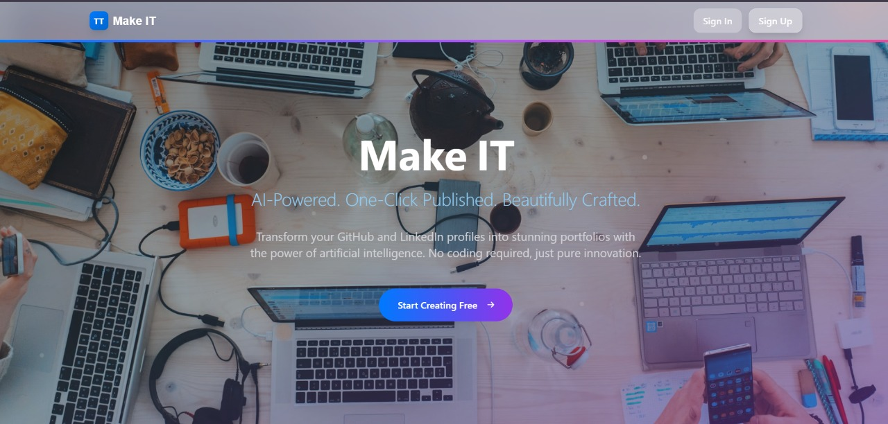
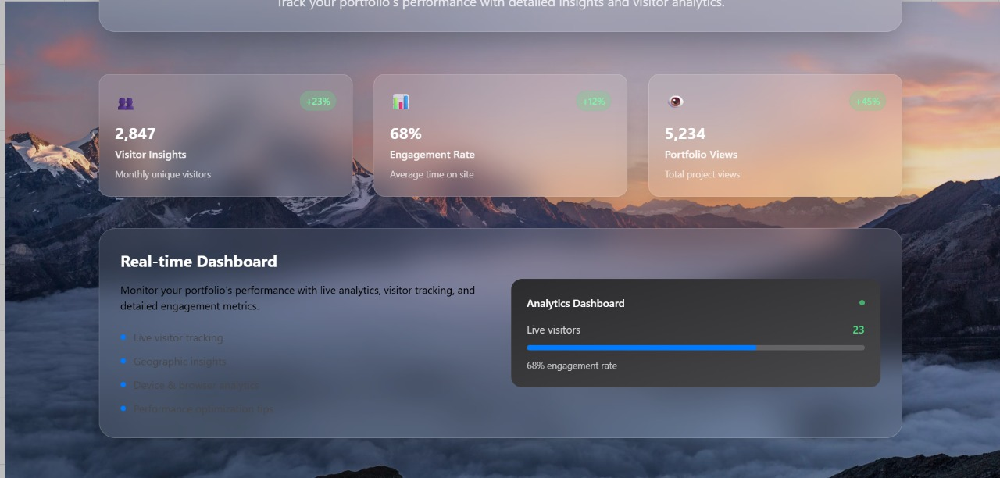
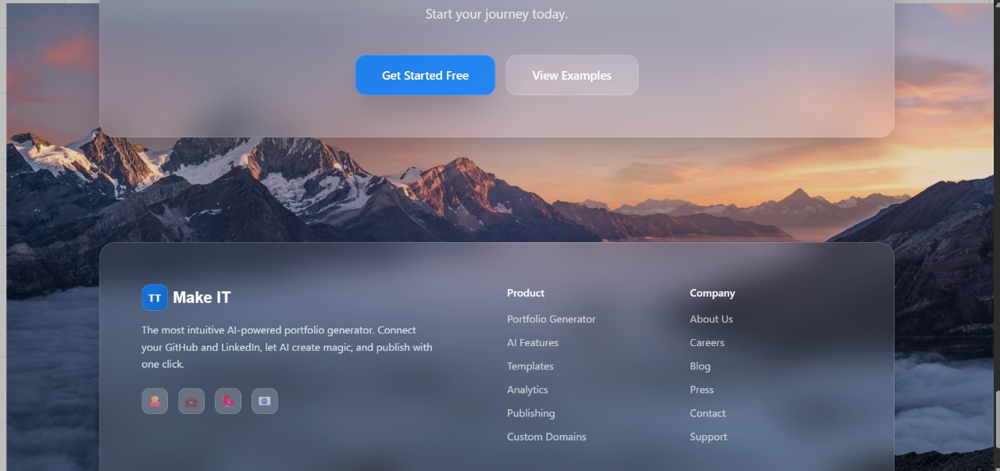
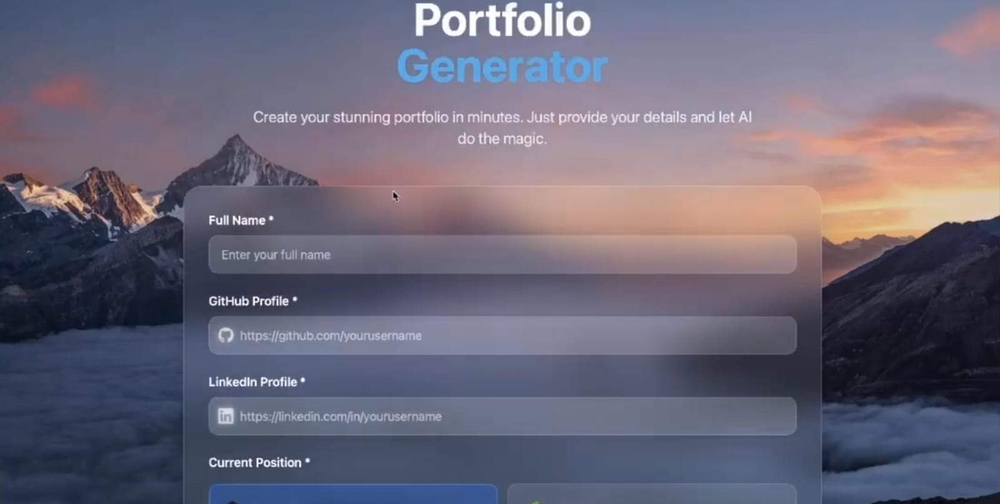
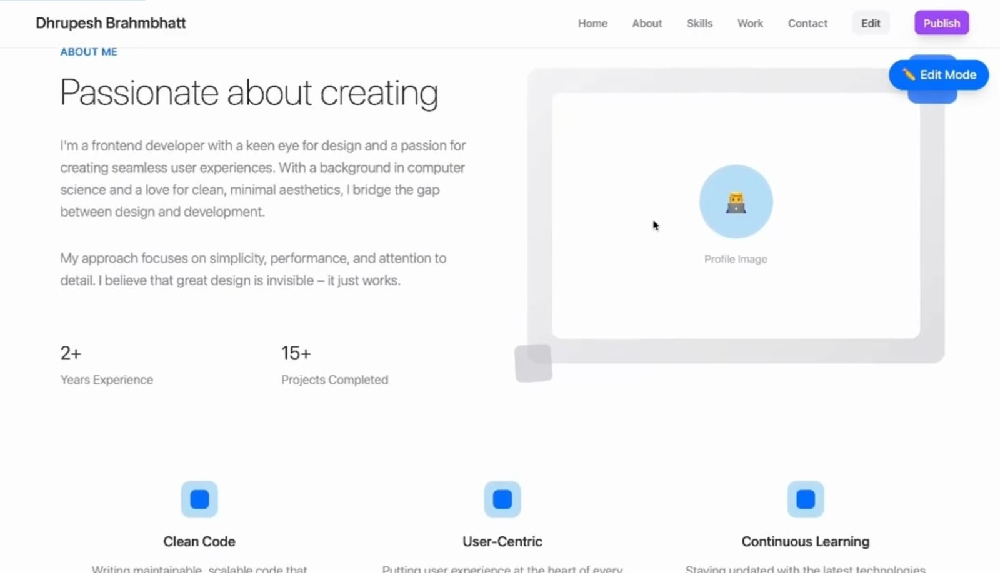

# MakeIt→
 


**Hackathon:** HackAura

Turn your GitHub + Resume + LinkedIn into a polished, professional portfolio — in minutes.

---

## 🚀 **Project Intro**
MakeIt→ is an AI-powered advanced portfolio builder that transforms your GitHub activity and resume and linkedin into a stunning personal website. Paste your GitHub profile, optionally upload your resume, choose a template, and let AI auto-fill a clean, recruiter-ready portfolio. Edit live, preview instantly, and publish with one click.

---

## 📌 **Problem Statement**
Building a professional portfolio is time-consuming and technical. Most students, freelancers, and developers struggle to:
 • Aggregate achievements across GitHub, resumes, and scattered docs.
 • Design a clean, modern portfolio without spending days on HTML/CSS.
 • Keep content fresh and consistent across projects and experiences.

MakeIt→ solves this by automating data aggregation, cleaning, and presentation using AI with editable, template-driven output.

---

## 🎯 **Objective**
 • Convert GitHub + Resume + LinkedIn into a structured, professional portfolio automatically.
 • Enable live WYSIWYG editing with instant preview.
 • Build a creator marketplace for premium templates with revenue sharing.
 • Offer frictionless deployment and shareable portfolio links.

---

## 🧠 **Team & Approach**
 • Rapid prototyping with clear separation of `FrontEnd/` and `BackEnd/` for speed and scalability.
 • API-first design with clean controllers, services, and helpers in `BackEnd/`.
 • Iterative UX: ship core flow first (Import → Merge → Template → Publish), then enhance editor and marketplace.

Team Members:
 • Shrestha Gupta(Leader): Frontend & Backend & AI Integrator
 • Maurya Sumit Ramnath – Fullstack Developer & System Architect
 

---

## 🧩 **Business Model**
 • Free: Access to a limited collection of templates and basic editing.
 • Premium: Unlimited templates, advanced AI customization, and priority publishing.
 • Creator Marketplace: Creators upload templates; users buy/rent; revenue is split.
 • Commission Example: 80% creator, 20% platform (configurable per campaign).

---

## 💡 **Uniqueness**
 • Automatic merging of GitHub + Resume into consistent, professional sections.
 • Live real-time editing and instant theme switching.
 • Revenue-sharing system for template creators.
 • AI-assisted template filling and professional data cleaning.

---

## ⚙️ **Scalability**
 • Node.js + Express backend with microservices-ready architecture.
 • MongoDB for user + portfolio data; GridFS for resume storage.
 • Pluggable template system supports third-party template uploads.
 • Ready for integrations with LinkedIn, Notion, and future blockchain/NFT ownership.

---

## 🧠 **Technical Implementation**
 • Frontend: React.js + Vite, Tailwind CSS (`FrontEnd/`)
 • Backend: Node.js, Express.js (`BackEnd/`)
 • Database: MongoDB (with GridFS for resume storage)
 • AI: Gemini API and HuggingFace NLP for resume parsing and data cleaning
 • GitHub API: Repository info, languages, stars, activity
 • Auth: JWT (and/or OAuth for GitHub, LinkedIn if required)
 • Hosting: Vercel (Frontend), Render/Railway (Backend)

---

## 🔀 **Work Flow**


MakeIt→ guides users from sign-in to publication with an AI-assisted pipeline. Users provide their GitHub link and resume; the backend fetches repos and parses the resume. AI merges and cleans the data, then the frontend presents a template gallery for free/premium selection. Users preview, live-edit, and publish; deployments generate a shareable portfolio link. A creator marketplace powers template monetization with automated revenue splits.
---

Directory structure highlights:
 • `FrontEnd/` — React app, Tailwind setup, Vite config
 • `BackEnd/` — Express app with `controllers/`, `routes/`, `services/`, `helpers/`, `middleware/`
 • `animation/` — Static showcase/landing visuals

---

## 🌍 **Social Impact**
 • Empowers students and job seekers to build professional portfolios rapidly.
 • Enables freelancers to present credible, AI-enhanced profiles.
 • Lowers the barrier for non-tech users to create a strong personal brand.
 • Boosts the creator economy with paid templates.

---

## 🛠️ **Tech Stack**
 • Frontend: React.js, Vite, Tailwind CSS
 • Backend: Node.js, Express.js
 • Database: MongoDB (+ GridFS)
 • AI: Google Gemini API, HuggingFace Transformers
 • External APIs: GitHub API, (optional) LinkedIn scraping/API
 • Deployment: Vercel (FE), Render/Railway (BE)

---

## ✨ **Key Features**
 • Paste GitHub URL + upload resume → instant draft portfolio
 • AI merge + clean: projects, roles, skills, achievements
 • Template gallery (free + premium) with creator uploads
 • Real-time editor with live preview and instant publish
 • Payments for premium templates with automatic revenue split
 • Shareable URL, custom domains supported

---

## 📸 **Screenshots**
Below are screenshots from the app flow and UI (rendered directly from the `ScreenShot/` directory):










---

## 📊 **APIs, Libraries & Acknowledgements**
 • GitHub REST API
 • Google Gemini API
 • HuggingFace Transformers/NLP
 • React, Vite, Tailwind CSS
 • Express.js, Mongoose
 • Vercel, Render/Railway

---

## ✅ **Tasks & Bonus Checklist**
 • [✅] GitHub import prototype
 • [✅] Resume parsing & AI merge (Gemini + HuggingFace)
 • [✅] Template selection + live preview
 • [✅] Payments integration
 • [✅] Marketplace creator dashboard
 • [✅] Revenue split automation
 • [✅] LinkedIn structured import
 • [✅] Template moderation & ratings

---

## 🧪 **How to Run the Project**
In two terminals:

Frontend (`FrontEnd/`):
```
npm install
npm run dev
# Opens at http://localhost:5173
```

Backend (`BackEnd/`):
```
npm install
npm run dev
# Serves API at http://localhost:5000 (configurable via .env)
```

Open the frontend, paste your GitHub URL, optionally upload a resume, and follow the flow.

---

## 🧬 **Future Scope**
 • Advanced AI content suggestions, tone/style presets
 • One-click import from LinkedIn, Notion, and Google Drive
 • Versioned templates and template diffing
 • NFT/Blockchain-based portfolio ownership and provenance
 • Multi-user collaboration on portfolios

---

## 📎 **Resources & Credits**
 • GitHub API docs: https://docs.github.com/en/rest
 • Google AI Studio (Gemini): https://ai.google.dev/
 • HuggingFace: https://huggingface.co/
 • Vercel: https://vercel.com/
 • Render: https://render.com/  |  Railway: https://railway.app/

---

## 🏁 **Final Words**
MakeIt→ accelerates personal branding by merging your real developer signal (GitHub) with a refined narrative (resume). Build once, update fast, and ship a beautiful portfolio that converts.

If you like it, star the repo and share your templates in the marketplace! Thank You For Your Time & Support!

---
